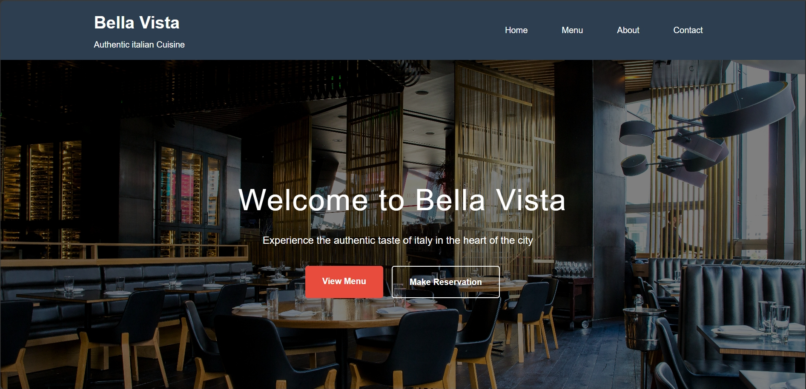
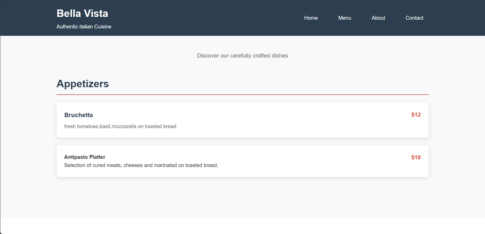
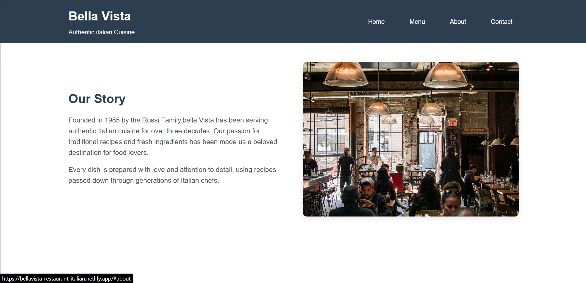
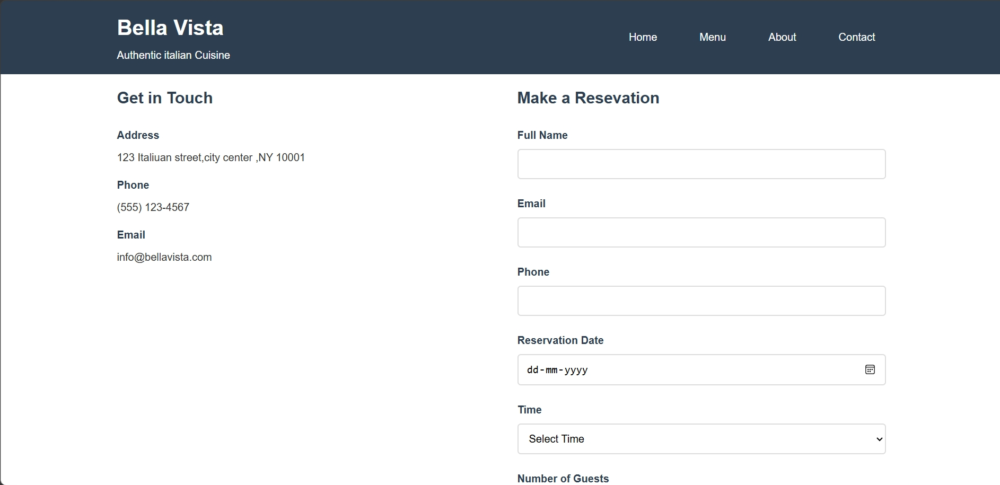

# Bellavista Restaurant – Italian Cuisine Website

## 📖 Overview
Bellavista Restaurant is a modern web project showcasing an Italian fine-dining experience. 
It highlights the restaurant’s menu, ambiance, and services while providing users with an elegant and responsive interface.
This project demonstrates front-end development skills, clean design practices, and user-friendly navigation.

---

## ✨ Features
- Responsive design for desktop, tablet, and mobile devices  
- Smooth navigation with intuitive layouts  
- Menu showcase with beautifully presented Italian dishes  
- About & Services sections highlighting the restaurant’s story and offerings  
- Contact and location details with map integration  
- Clean typography, color palette, and imagery  

---

## 🛠️ Tech Stack
- **HTML5** – Semantic structure  
- **CSS3** – Styling and responsive design    
- **GitHub Pages / Hosting** – Live deployment  

---

## 🚀 Getting Started

### Clone the repository

git clone https://github.com/dilkashkhan786/bellavista-restaurant-italian.git

## 📸 Screenshots

### Home Page

### Menu Section

### About Us

### Contact Page

